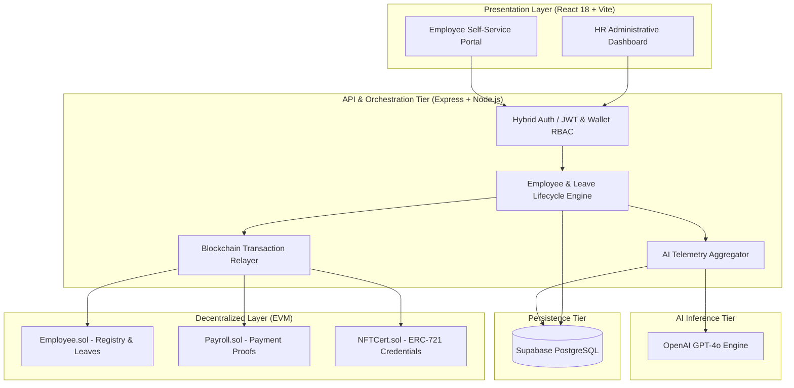

# STAFFI: Web3-Enabled Decentralized HR Management & Predictive AI Workforce Analytics

[](https://react.dev)
[](https://www.typescriptlang.org)
[](https://soliditylang.org)
[](https://hardhat.org)
[](https://nodejs.org)
[](https://expressjs.com)
[](https://supabase.com)
[](https://openai.com)
[](LICENSE)

> **"Decentralizing Workforce Governance Through Cryptographic Ledger Audits and Stochastic AI Telemetry."**

STAFFI is a hybrid Web3 Human Resource Information System (HRIS) and predictive workforce intelligence platform. It replaces opaque, centralized corporate record-keeping with immutable EVM smart contract attestations, ERC-721 verifiable competency credentialing, and OpenAI-driven retention and burnout analytics.

<div align="center">

[Overview](#abstract) | [Why STAFFI?](#why-staffi) | [System Architecture](#system-architecture) | [Smart Contracts](#smart-contract-infrastructure) | [AI Engine](#predictive-ai-workforce-analytics) | [Database](#database-architecture) | [Quickstart](#quickstart--reproducibility)

</div>

---

## Abstract

Traditional HR management systems suffer from mutable audit trails, arbitrary record tampering, opaque leave approvals, and reactive exit surveys. Crucial employment events—such as payroll disbursements, statutory leave records, and verified achievements—reside in centralized databases vulnerable to unilateral modifications without cryptographic proof.

**STAFFI** resolves these challenges by bridging decentralized EVM infrastructure with predictive machine intelligence:
- **Immutable On-Chain Audits**: Personnel registrations, status transitions, leave approvals, and payroll event receipts are committed to Ethereum/Polygon smart contracts.
- **Verifiable Digital Credentials**: Employee achievements and skill certifications are minted as ERC-721 non-fungible tokens, providing portable, tamper-proof proof of accomplishments.
- **Predictive Retention Telemetry**: Longitudinal workforce telemetry (leave patterns, milestone frequency, tenure velocity) is processed via OpenAI GPT-4o to stratify burnout risk (`LOW`, `MEDIUM`, `HIGH`) and prescribe proactive retention interventions.
- **Hybrid Role-Based Portals**: Responsive React 18 workspaces offering dedicated HR Administration and Employee Self-Service portals with non-custodial Web3 wallet integration.

---

## Why STAFFI?

| Challenge in Legacy HRIS | Risk / Impact | STAFFI Cryptographic & AI Solution |
| :--- | :--- | :--- |
| **Mutable Database Records** | Retroactive leave modifications, payroll disputes | **EVM State Inscriptions**: Registrations, approvals, and payout proofs stored permanently on-chain |
| **Credential Forgery** | Unverifiable resumes and internal training claims | **ERC-721 Credential Tokens**: Cryptographically verifiable on-chain certificates linked to employee UUIDs |
| **Reactive Retention** | Exit surveys occur after resignations | **Stochastic AI Telemetry**: Early risk detection and automated HR intervention strategies via GPT-4o |
| **High Web3 UX Friction** | Workers forced to hold crypto and pay gas fees | **Gasless Enterprise Flow**: Backend-relayed transactions with dual wallet/JWT authentication |
| **Siloed Administration** | Fragmented tools for payroll, leaves, and analytics | **Unified Management Workspace**: Single-pane-of-glass dashboard built with TailwindCSS & Radix UI |

---

## System Architecture

STAFFI uses a decoupled multi-tier architecture separating presentation, business orchestration, cryptographic consensus, and intelligence inference:



---

## Core Functional Modules

### 1. Hybrid Authentication & Role-Based Access Control
- **HR Portal**: Non-custodial Web3 wallet authentication (`MetaMask`, `wagmi`, `viem`). The public address is verified against authorized administrative records.
- **Employee Portal**: Enterprise email and password authentication hashed with bcrypt, generating stateless JWT sessions with role and department claims.
- **Onboarding Pipeline**: Prospective employees submit onboarding requests (`POST /api/employee/request`). HR reviews and approves requests before database persistence and on-chain registration occur.

### 2. Employee Lifecycle & Status Tracking
- **Decentralized Personnel Registry**: Employee profiles are registered with immutable properties (`name`, `role`, `department`, `doj`, and optional wallet address).
- **Audit-Stamped Status Transitions**: Status updates (`ACTIVE`, `ON_LEAVE`, `PROBATION`, `TERMINATED`) are recorded with timestamps and audit reasons in contract state.

### 3. Leave Management & On-Chain Anchoring
- **Self-Service Requests**: Employees lodge leave applications specifying dates and justifications.
- **Cryptographic Approval**: HR approvals invoke on-chain contract transactions, recording the leave duration and justification permanently on the ledger.

### 4. Payroll Verification Ledger
- **Payment Attestation**: Rather than moving volatile tokens on-chain, STAFFI records immutable cryptographic proofs of disbursements.
- **Tamper-Evident Receipts**: Each payout emits a verifiable EVM event with employee ID, recipient wallet, amount, and block timestamp.

### 5. Verifiable Competency NFT Certificates
- **ERC-721 Minting**: Milestone achievements and internal certifications are tokenized as non-fungible tokens.
- **Portable Credentials**: Tokens link directly to verifiable metadata URIs and the employee's unique identifier.

---

## Smart Contract Infrastructure

Contracts are developed in Solidity `^0.8.20` using OpenZeppelin's audited standards for access control and token primitives:

| Contract | Standard / Inheritance | Primary Interface | Functional Responsibility |
| :--- | :--- | :--- | :--- |
| **`Employee.sol`** | `Ownable` | `addEmployee()`, `updateEmployeeStatus()`, `leaveApproved()` | Decentralized employee registry, status audit history, and leave approval ledger |
| **`Payroll.sol`** | `Ownable` | `logPayroll()` | Inscribes salary payment proofs and emits on-chain verifiable audit events |
| **`NFTCert.sol`** | `ERC721`, `Ownable` | `mintCertificate()`, `tokenURI()` | Mints non-fungible achievement certificates linked to employee UUIDs and metadata URIs |

---

## Predictive AI Workforce Analytics

The intelligence engine operationalizes OpenAI's GPT-4o model to convert historical workforce telemetry into predictive retention insights:

| Analytics Stage | Mechanism | Output / Impact |
| :--- | :--- | :--- |
| **Feature Extraction** | Aggregates leave velocity, tenure, certification milestones, and compensation cadence | Normalized structured employee profile payload |
| **Risk Stratification** | Low-temperature evaluation ($\tau = 0.3$) against specialized HR diagnostic prompts | Categorical risk index: `LOW`, `MEDIUM`, or `HIGH` |
| **Prescriptive Action** | Contextual natural language processing | 3 targeted, actionable HR retention recommendations |
| **Audit Logging** | Relational persistence in PostgreSQL `ai_logs` table | Longitudinal risk tracking and workforce health trends |

---

## Database Architecture

The persistence tier runs on PostgreSQL via Supabase, with UUID primary keys, relational constraints, and automatic timestamp triggers:

| Entity Table | Primary Key | Foreign Keys | Functional Scope |
| :--- | :--- | :--- | :--- |
| **`employees`** | `id` (UUID) | `role_id`, `department_id` | Core personnel roster, authentication hash, and wallet binding |
| **`employee_requests`** | `id` (UUID) | `role_id`, `department_id`, `approved_by` | Prospective employee onboarding queue with approval workflow |
| **`hr_users`** | `id` (UUID) | None | Authorized HR wallet addresses and administrative metadata |
| **`leaves`** | `id` (UUID) | `emp_id` $\to$ `employees.id` | Leave requests, durations, status state machine, and timestamps |
| **`payrolls`** | `id` (UUID) | `emp_id` $\to$ `employees.id` | Payment records linked to on-chain transaction hashes |
| **`certificates`** | `token_id` (INT) | `emp_id` $\to$ `employees.id` | Issued NFT certificate credentials and metadata URIs |
| **`ai_logs`** | `id` (UUID) | `emp_id` $\to$ `employees.id` | Historical AI risk assessments, input factors, and suggestions |

---

## RESTful API Endpoints

| Category | Method & Endpoint | Access | Function |
| :--- | :--- | :--- | :--- |
| **Auth** | `POST /api/auth/hr-login` | Public | Authenticates HR user via Web3 wallet address |
| | `POST /api/auth/employee-login` | Public | Authenticates employee via email/password, returns JWT |
| **Employee** | `POST /api/employee/request` | Public | Submits new employee onboarding request |
| | `GET /api/hr/employee-requests` | HR Only | Fetches pending employee onboarding requests |
| | `POST /api/hr/employee-requests/:id/approve` | HR Only | Approves employee request and triggers on-chain registration |
| | `GET /api/employee/all` | HR Only | Retrieves full employee directory with role/department joins |
| **Leaves** | `POST /api/leave/apply` | Employee | Lodges new leave application |
| | `GET /api/leave/my-leaves` | Employee | Retrieves personal leave history |
| | `POST /api/leave/:id/approve` | HR Only | Approves leave and triggers smart contract attestation |
| **Payroll** | `POST /api/payroll/send` | HR Only | Records payment on-chain and logs transaction proof |
| **AI Analytics** | `POST /api/ai/predict` | HR Only | Generates real-time GPT-4o flight-risk assessment |
| | `GET /api/ai/history/:empId` | HR Only | Retrieves longitudinal AI risk history for an employee |

---

## Technology Stack

| Layer | Technologies |
| :--- | :--- |
| **Frontend** | React 18, TypeScript, Vite, TailwindCSS, Shadcn/UI (Radix UI), Framer Motion, Recharts |
| **Web3 & Blockchain** | Solidity `^0.8.20`, Hardhat, OpenZeppelin, Ethers.js v6, Wagmi, MetaMask SDK |
| **Backend & API** | Node.js, Express, Winston Logger, Helmet, JWT, CORS |
| **Database** | Supabase (PostgreSQL with UUIDs, RLS, and Triggers) |
| **Artificial Intelligence** | OpenAI API (GPT-4o) |

---

## Project Structure

```bash
STAFFI/
├── contracts/                   # Smart contract workspace
│   ├── contracts/               # Employee.sol, Payroll.sol, NFTCert.sol
│   ├── scripts/                 # Deployment and testing scripts
│   └── test/                    # Hardhat test suites
├── backend/                     # Express REST API & Orchestration
│   ├── controllers/             # Business logic (admin, employee, leave, payroll)
│   ├── routes/                  # API route definitions
│   ├── services/                # Blockchain, AI (GPT-4o), Supabase services
│   ├── schema.sql               # PostgreSQL schema definition
│   └── server.js                # Express entrypoint
├── frontend/                    # React 18 + Vite presentation portal
│   ├── src/pages/dashboard/     # HR Administrative views (Leaves, Payroll, AI Insights)
│   ├── src/pages/employee/      # Employee Self-Service views (Requests, Projects, NFTs)
│   ├── src/components/          # Reusable UI widgets and Web3 connectors
│   └── src/App.tsx              # Application router
└── README.md                    # System documentation
```

---

## Quickstart & Reproducibility

### 1. Prerequisites
- **Node.js** `v18+` & **npm** `v9+`
- **MetaMask** or EVM browser extension
- **Supabase** account & **OpenAI API Key**

### 2. Environment Setup
Configure `.env` in the root and `backend/` directory:
```bash
PORT=5000
SUPABASE_URL=https://your-supabase-project.supabase.co
SUPABASE_SERVICE_ROLE_KEY=your-supabase-key
ETHEREUM_RPC_URL=https://sepolia.infura.io/v3/your-infura-key
PRIVATE_KEY=your-deployer-private-key
EMPLOYEE_CONTRACT_ADDRESS=0xYourDeployedAddress
PAYROLL_CONTRACT_ADDRESS=0xYourDeployedAddress
NFT_CONTRACT_ADDRESS=0xYourDeployedAddress
OPENAI_API_KEY=sk-your-openai-api-key
JWT_SECRET=your-jwt-secret
```

### 3. Deploy Smart Contracts
```bash
cd contracts
npm install
npx hardhat test
npx hardhat run scripts/deployEmployee.js --network sepolia
npx hardhat run scripts/deployPayroll.js --network sepolia
npx hardhat run scripts/deployNFTCert.js --network sepolia
```

### 4. Start Backend Server
```bash
cd backend
npm install
npm run dev
```

### 5. Launch Frontend Portal
```bash
cd frontend
npm install
npm run dev
```

---

## License

This project is open-source under the [MIT License](LICENSE).
